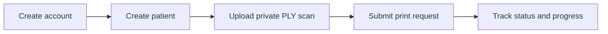
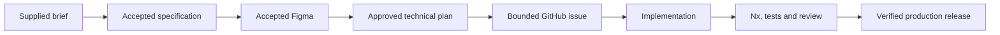

# Vytruve Technical Assessment

A production-minded React and NestJS application for orthoprosthetists to manage patients, store private 3D scans,
and submit and follow socket-printing requests.

[Live application](https://vytruve.blockoutproject.com) ·
[Product design](https://www.figma.com/design/tnvp3CFNnb4aC6VWTkK2BI/Vytruve-Product-Design?node-id=309-3) ·
[Specification](specs/001-orthoprosthetist-printing-workflow/spec.md) ·
[Final delivery issue](https://github.com/hugoecken/vytruve-tech-test-he/issues/43)

## Product journey



The delivered MVP includes cookie-based authentication, owner-scoped patient records, validated PLY upload and
download, private MinIO storage, duplicate-safe printing submission, provider reconciliation, localization, and
responsive desktop and compact layouts.

Editing or deleting patients, deleting scans, cancelling prints, password recovery, MFA, billing, and clinical or
regulatory claims are deliberately outside the assessment.

## Run locally

Requirements: Node.js 24 LTS, npm 10, and Docker with Docker Compose.

```bash
npm ci
cp .env.example .env.local
npm exec nx -- run infrastructure:up
npm exec nx -- run database:migrate
npm start
```

Open the Web application at `http://localhost:4200`. The API is available at `http://localhost:3000/api`.

Stop the application with `Ctrl+C`, then stop retained local services without deleting their data:

```bash
npm exec nx -- run infrastructure:down
```

The committed environment example contains synthetic development placeholders only. Real credentials belong only in
the ignored `.env.local` file. See [Local development](docs/local-development.md) for the full lifecycle, migration,
generation, and image commands; [Testing and quality](docs/testing-and-quality.md) owns verification commands.

## Engineering workflow



Each transition had a clear authority and a human acceptance gate. AI accelerated analysis, implementation, review,
and operations, while the author challenged proposals, approved product and architecture decisions, reviewed diffs,
and authorized external mutations. The complete evidence loop is documented in
[AI-assisted workflow](docs/ai-assisted-workflow.md).

## Documentation

| Topic                                                              | What it explains                                                                         |
| ------------------------------------------------------------------ | ---------------------------------------------------------------------------------------- |
| [Architecture](docs/architecture.md)                               | System boundaries, repository structure, and runtime topology.                           |
| [Local development](docs/local-development.md)                     | Environment setup, Docker, Liquibase, generation, commands, and image smoke checks.      |
| [Authentication and security](docs/authentication-and-security.md) | Session lifecycle, authorization, validation, errors, and protected-data boundaries.     |
| [Frontend](docs/frontend.md)                                       | Routing, server state, forms, localization, accessibility, responsive design, and Figma. |
| [Backend and data](docs/backend-and-data.md)                       | NestJS boundaries, PostgreSQL, Liquibase, MinIO, uploads, and generated contracts.       |
| [Printing integration](docs/printing-integration.md)               | Non-idempotent submission, failure handling, reconciliation, and progress.               |
| [Testing and quality](docs/testing-and-quality.md)                 | Test strategy, quality commands, evidence, and current limitations.                      |
| [Delivery](docs/delivery.md)                                       | Git flow, Nx affected selection, GitHub Actions, image identity, and release order.      |
| [AI-assisted workflow](docs/ai-assisted-workflow.md)               | How AI was used, challenged, constrained, reviewed, and verified.                        |
| [Decisions and limitations](docs/decisions-and-limitations.md)     | Consequential choices, trade-offs, exclusions, and next evidence.                        |
| [Dokploy runbook](infrastructure/dokploy/README.md)                | Exact production resources, variables, webhooks, health checks, and rollback.            |

## Verification snapshot

- API: 12 Jest suites, 60 tests.
- Web: 7 Vitest files, 33 tests.
- CI: formatting, Liquibase validation, OpenAPI/Orval generation, affected lint/type-check/test/build, then selective
  immutable-image delivery.
- Production: revision-aware API and Web health checks close every selected deployment stage.

The repository keeps the accepted specification and plan as authorities, GitHub issues and pull requests as execution
history, and source, migrations, contracts, tests, and deployed health as final evidence.
