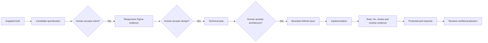
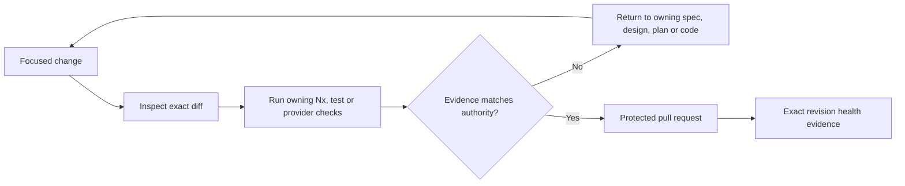

# AI-Assisted Engineering Workflow

[Back to the main README](../README.md)

AI was used as an engineering accelerator, not as an authority. It helped analyze, compare, implement, test, review,
and operate. The author remained responsible for product intent, architecture acceptance, technical challenge, every
external mutation, and the final result.

This separation made the workflow faster without turning it into blind code generation.

## Evidence-driven flow

[Open the accepted Product Design evidence in Figma](https://www.figma.com/design/tnvp3CFNnb4aC6VWTkK2BI/Vytruve-Product-Design?node-id=309-3)

## Inspectable evidence

- [Accepted product specification](../specs/001-orthoprosthetist-printing-workflow/spec.md)
- [Approved technical plan](../specs/001-orthoprosthetist-printing-workflow/plan.md)
- [Final delivery issue](https://github.com/hugoecken/vytruve-tech-test-he/issues/43)
- [GitHub Actions workflow](../.github/workflows/ci.yml)
- [CI and release history](https://github.com/hugoecken/vytruve-tech-test-he/actions)
- [Live revision-verified application](https://vytruve.blockoutproject.com)

The supplied brief is intentionally not copied into the repository because its appendix contains protected contact and
provider information. Its requirements are preserved through the accepted specification and delivery evidence.

## Authority remained explicit

| Stage                   | AI contribution                                                             | Human-owned decision or proof                                                      |
| ----------------------- | --------------------------------------------------------------------------- | ---------------------------------------------------------------------------------- |
| Brief and specification | Extract requirements, expose ambiguity, draft traceable scenarios.          | Accept observable product intent and exclusions.                                   |
| Figma                   | Reconcile responsive states and inspect consistency with the specification. | Accept visual composition and user-facing behavior.                                |
| Technical plan          | Compare options, identify risks, and simplify boundaries.                   | Approve architecture, persistence, provider, security, and delivery choices.       |
| GitHub issue            | Turn accepted scope into one reviewable delivery unit.                      | Authorize issue, branch, PR, merge, and production mutations.                      |
| Development             | Implement focused code and tests under repository guidance.                 | Challenge abstractions, inspect diffs, and reject unnecessary machinery.           |
| Verification            | Run repository commands, analyze failures, and gather evidence.             | Treat tests, contracts, migrations, and runtime health as proof—not AI confidence. |
| Release                 | Operate documented GitHub and Dokploy boundaries.                           | Approve promotion and require the exact deployed revision to become healthy.       |

## How proposals were challenged

The author did not accept generated infrastructure or workflow choices by default. Concrete challenges improved the
result:

- changed-project selection was delegated to official `nx affected` instead of a hand-maintained deployment list;
- the CI workflow was reduced to framework and provider primitives instead of repository-specific orchestration code;
- PostgreSQL, MinIO, Liquibase, API, and Web were kept as independent Dokploy resources instead of one global Compose;
- Liquibase became a blocking one-shot stage before affected applications, with no automatic database rollback;
- Dokploy webhooks remained deployment triggers, while revision-aware health checks became the success proof;
- ambiguous printing submissions were not retried blindly because preventing duplicate physical jobs mattered more
  than hiding uncertainty;
- required GitHub approval counts were removed for the solo-maintainer context without weakening pull-request and
  check protection; and
- obsolete or needlessly complex image and workflow choices were questioned, simplified, and reverified.

This is the central value of the workflow: AI increased exploration and execution speed, while engineering judgment
reduced the result to the smallest solution that still protected real boundaries.

## Verification loop

Generated output was changed only through its owning command. Protected values, supplied scans, patient data, cookies,
logs, and provider payloads were excluded from source and evidence. Failures were diagnosed rather than suppressed,
and unresolved limitations were documented instead of presented as production guarantees.

## Result

The repository history shows the full chain from requirements to production rather than a single unexplained code
dump. A reviewer can inspect the accepted specification, Figma evidence, plan, bounded issues, focused commits, tests,
CI selection, immutable images, and deployed health independently.

AI contributed materially to the work. It did not replace understanding, challenge, accountability, or proof.
