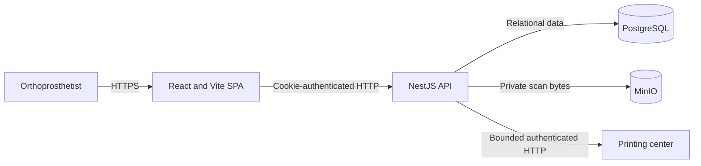
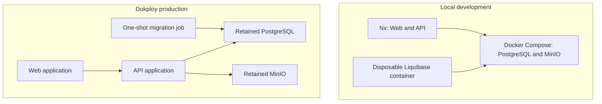

# Architecture

[Back to the main README](../README.md)

The accepted [specification](../specs/001-orthoprosthetist-printing-workflow/spec.md) owns observable behavior. The
accepted [technical plan](../specs/001-orthoprosthetist-printing-workflow/plan.md) owns its technical translation.
This document is a map of the delivered system, not another architecture authority.

## System boundary

The browser talks only to the API. NestJS owns authentication, authorization, validation, persistence coordination,
file handling, provider translation, and safe public errors. PostgreSQL, MinIO, and the printing provider are never
exposed directly to Web users.

## Repository map

| Path                                           | Responsibility                                                                                     |
| ---------------------------------------------- | -------------------------------------------------------------------------------------------------- |
| `apps/web`                                     | React routes, feature UI, forms, server-state presentation, localization, and responsive behavior. |
| `apps/api`                                     | NestJS HTTP boundary and account, authentication, patient, scan, printing, and health features.    |
| `database`                                     | Ordered Liquibase changelog and migration container definition.                                    |
| `infrastructure`                               | Local retained services and focused Dokploy production resources.                                  |
| `specs/001-orthoprosthetist-printing-workflow` | Accepted product specification, plan, and derived planning evidence.                               |

## Chosen boundaries

- One Nx workspace owns task discovery, dependencies, caching, and affected selection.
- The Web application owns presentation; generated clients own transport; the API remains the trust boundary.
- NestJS features separate HTTP, use-case coordination, and concrete persistence or provider mechanics.
- Liquibase owns schema history; TypeORM maps the resulting schema without synchronizing it.
- PostgreSQL owns relational state; MinIO owns opaque private scan bytes.
- The printing provider stays behind one adapter and never leaks its payloads or vocabulary into the public contract.

These are focused boundaries for the assessment, not a generic platform. There is no CQRS layer, event bus, queue,
generic repository framework, or speculative microservice split.

## Runtime topology

Production applications are replaceable releases; PostgreSQL and MinIO are retained resources. Migration, API, and
Web remain independent release stages. See [Delivery](delivery.md) for selection and order, and the
[Dokploy runbook](../infrastructure/dokploy/README.md) for operations.

## Detailed views

- [Backend and data](backend-and-data.md)
- [Authentication and security](authentication-and-security.md)
- [Frontend](frontend.md)
- [Printing integration](printing-integration.md)
