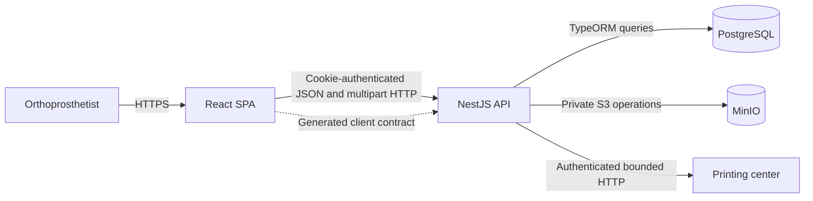
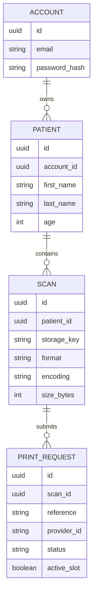
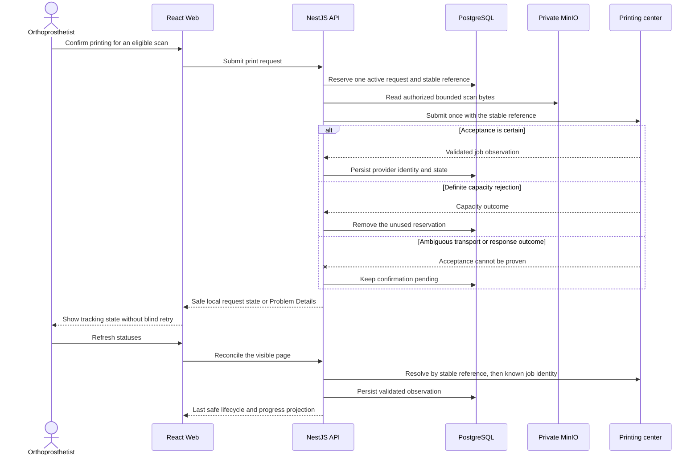
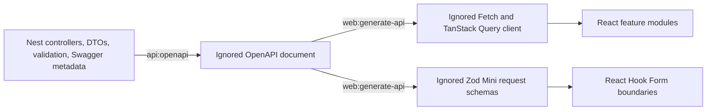

# Architecture

[Back to the main README](../README.md)

This document explains the delivered architecture. The accepted
[specification](../specs/001-orthoprosthetist-printing-workflow/spec.md) owns observable behavior and the accepted
[technical plan](../specs/001-orthoprosthetist-printing-workflow/plan.md) owns its technical translation.

## System overview

The browser never connects directly to PostgreSQL, MinIO, or the printing center. The API owns authentication,
authorization, validation, persistence coordination, file handling, provider translation, and safe public errors.

## Repository boundaries

| Path                                           | Responsibility                                                                                                                |
| ---------------------------------------------- | ----------------------------------------------------------------------------------------------------------------------------- |
| `apps/web`                                     | Client-rendered React/Vite application, routes, forms, server-state presentation, localization, and accessible responsive UI. |
| `apps/api`                                     | NestJS HTTP boundary and feature modules for accounts, authentication, patients, scans, printing, and health.                 |
| `database`                                     | Liquibase master changelog and ordered PostgreSQL schema changes.                                                             |
| `infrastructure`                               | Local Docker Compose services and the focused Dokploy production resources.                                                   |
| `specs/001-orthoprosthetist-printing-workflow` | Accepted product specification, plan, derived tasks, and supporting design-time artifacts.                                    |

Within each backend feature, transport code lives under `api`, use-case coordination under `application`, and TypeORM,
MinIO, cryptographic, or provider mechanics under `infrastructure`. This is a boundary convention, not a generic
framework: features share only proven cross-cutting HTTP, pagination, persistence-error, and validation foundations.

## Data ownership

PostgreSQL owns relational metadata, ownership, print references, and the last safely observed print state. MinIO owns
only private scan bytes under application-generated UUID keys. The public API never returns password hashes, storage
keys, bucket details, provider credentials, or raw provider payloads.

Liquibase owns the schema and durable `DATABASECHANGELOG` history. TypeORM maps that schema with `synchronize: false`
and `migrationsRun: false`. Applied production changelogs are immutable; later schema evolution must append compatible
changes so the immediately previous API image remains a viable application rollback.

## Scan storage flow

1. The global authentication guard derives the account identity from the verified cookie.
2. The scan use case proves patient ownership before parsing or storing content.
3. Transport and application validation enforce one bounded PLY 1.0 mesh; filename and MIME claims are not trusted.
4. The API writes bytes under a random UUID key in the private bucket, then persists safe metadata.
5. If metadata persistence fails, the API removes that exact new object as compensation.
6. Downloads repeat patient and scan ownership checks, validate stored size, and stream content through the API with a
   synthetic filename.

The database and object store do not share a transaction. The narrow compensation above protects new uploads without
introducing a queue or speculative cleanup service.

## Printing and reconciliation flow

The provider submission is non-idempotent and is never retried automatically. A durable reservation is created first;
ambiguous outcomes remain `confirmation_pending` and are reconciled by the same reference. Persisted list reads and
provider refreshes are separate, so provider latency cannot prevent the last safe page from loading.

The public lifecycle is provider-neutral: confirmation pending, queued, in progress, completed, or failed. Progress is
absent while confirmation is unknown, `0%` before scheduled work starts, time-derived and capped at `99%` while active,
and `100%` only after success.

## Executable contract synchronization

NestJS remains the runtime contract authority. Orval generates browser transport types, hooks, and selected request
schemas from the emitted OpenAPI document. Generated files are reproducible, ignored, and never edited manually.

## Runtime and health model

Local development runs PostgreSQL and MinIO in Docker Compose while Nx runs the API and Vite processes on the host.
Liquibase uses a disposable Compose profile container. Named volumes retain local database and scan state through
normal shutdown.

Production uses five independent Dokploy resources: retained PostgreSQL, retained MinIO, a one-shot migration Schedule
Job, the API application, and the Web application. API readiness checks the expected source revision, PostgreSQL, and
MinIO; it intentionally excludes the printing provider. Web health verifies the expected revision served by the
unprivileged Nginx container. See the [production handover](../infrastructure/dokploy/README.md).
