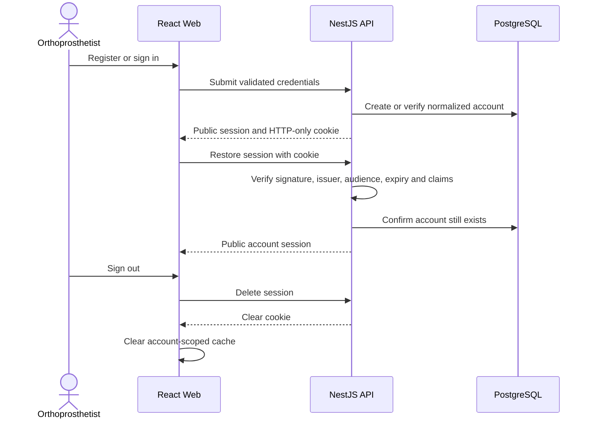
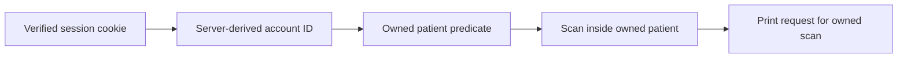

# Authentication and Security

[Back to the main README](../README.md)

The API issues a short-lived JWT in an HTTP-only cookie. Authentication identifies the account; every patient, scan,
and print operation then enforces owner-scoped authorization on the server.

## Session lifecycle

Passwords are hashed with Argon2id. Unknown accounts and invalid passwords produce the same public failure. Registration
and sign-in are rate-limited.

The 30-minute cookie uses `HttpOnly`, `SameSite=Lax`, `Path=/api`, and `Secure` in production. The JWT contains only the
account identifier and standard issuer, audience, issued-at, and expiry claims. It never enters a response body, URL,
React state, `localStorage`, or `sessionStorage`.

## Authorization

Every route is protected unless explicitly public. Controllers never trust an account identifier supplied by the
browser. Unknown and foreign-owned resources return the same not-found category so existence is not disclosed.

## Input and error boundaries

- One global Nest `ValidationPipe` transforms known values, strips nothing silently, and rejects unknown properties.
- DTOs own scalar constraints; scan size and PLY structure are checked again at the application boundary.
- Public failures use RFC 9457 Problem Details with stable codes.
- The global filter removes framework, database, storage, and provider details.
- The frontend translates stable codes; raw server, Zod, or provider text is never user-facing.
- Helmet sets standard security headers and credentialed CORS accepts only the configured Web origin.

## Protected data

MinIO is private. Original filenames are not retained, and object keys are opaque UUIDs. Logs exclude names, emails,
cookies, credentials, connection strings, scan bytes, raw provider bodies, and original filenames.

The repository contains only synthetic examples. Real provider, JWT, PostgreSQL, MinIO, GitHub, and Dokploy secrets
belong in ignored local configuration or their owning secret stores. Exact local and production configuration names
are documented in [Local development](local-development.md#configuration) and the
[Dokploy runbook](../infrastructure/dokploy/README.md#github-production-environment).

This assessment does not claim GDPR, HDS, medical-device, or other formal certification.
