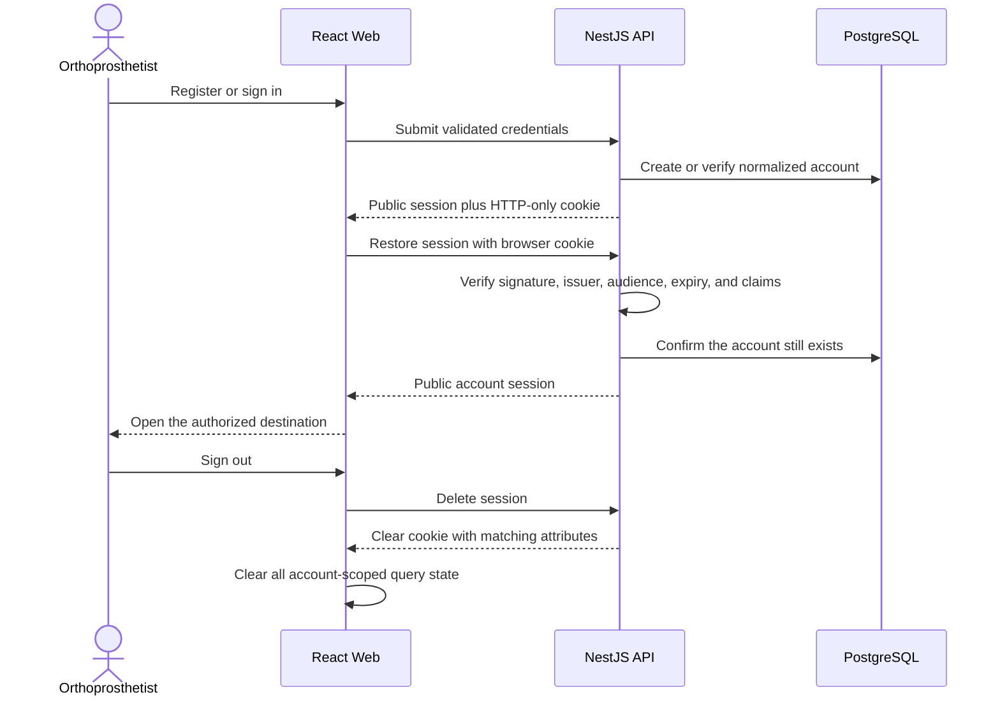

# Authentication and Security

[Back to the main README](../README.md)

The application uses a short-lived server-issued JWT stored only in an HTTP-only cookie. Authentication identifies an
account; every patient, scan, and print operation then applies owner-scoped authorization on the server.

## Session lifecycle

Passwords are hashed with Argon2id before persistence. Login uses the same generic public failure for an unknown account
and an invalid password. Account creation and sign-in are rate-limited through the Nest throttler.

JWTs contain only the account identifier plus standard issuer, audience, issued-at, and expiry claims. The session
lifetime is 30 minutes. The cookie uses:

- `HttpOnly` so browser JavaScript cannot read the token;
- `SameSite=Lax` for the same-site browser model;
- `Path=/api` to avoid sending it to unrelated Web assets; and
- `Secure` in production.

The token never enters a response body, URL, frontend state, `localStorage`, or `sessionStorage`. The frontend restores
the public session before route guards mount, clears all account-scoped TanStack Query state on sign-out or expiry, and
retains only a validated internal redirect destination.

## Authorization and data minimization

The authentication guard protects every API route unless it is explicitly marked public. Controllers receive the
server-derived account subject; they do not accept an account identifier from the browser.

Patient queries combine resource and owner predicates. Scan access first verifies the parent patient and then resolves
the scan within that patient. Print operations follow the same patient and scan chain. Unknown and foreign-owned
resources therefore return the same not-found category without disclosing existence.

The application retains only the assessment fields needed for accounts, patients, scans, and print tracking. It does
not claim GDPR, HDS, medical-device, or other formal certification.

## Input and error boundaries

Nest applies one global `ValidationPipe` with transformation, whitelisting, and rejection of unknown properties.
Feature DTOs own scalar constraints. The scan boundary repeats the byte limit at transport and application levels and
validates PLY structure from bounded content rather than trusting extensions or MIME types.

Every public failure is returned as RFC 9457 Problem Details with a stable `code`. The global filter removes framework,
database, storage, and provider detail. The frontend maps stable codes and field violations to localized messages; raw
server, schema-generator, or provider text is never presented to users.

Helmet supplies standard HTTP security headers. Credentialed CORS accepts only the configured Web origin. The current
production routing serves Web and `/api` on one site and uses `SameSite=Lax`; introducing a cross-site credential flow
would require a fresh CSRF and cookie-policy review.

## Protected storage and integrations

MinIO is private and reachable only through the API. Object names are opaque UUIDs, and original upload names are not
retained or logged. Storage errors cross the adapter as safe unavailable or not-found categories.

The printing adapter alone owns the provider URL, credential, timeout, request shape, and runtime response validation.
It applies a finite timeout and logs only safe operation categories, durations, HTTP status categories, local request
identifiers, and stable references. It never logs credentials, uploaded bytes, raw provider bodies, names, emails,
cookies, or connection strings.

## Configuration boundaries

The API requires and validates these server-side names before listening:

| Concern           | Variables                                                                                                                      |
| ----------------- | ------------------------------------------------------------------------------------------------------------------------------ |
| Runtime           | `NODE_ENV`, `APP_REVISION`, `API_PORT`, `WEB_ORIGIN`                                                                           |
| JWT               | `JWT_SECRET`, `JWT_ISSUER`, `JWT_AUDIENCE`                                                                                     |
| PostgreSQL        | `DATABASE_HOST`, `DATABASE_PORT`, `POSTGRES_DB`, `POSTGRES_USER`, `POSTGRES_PASSWORD`                                          |
| Scan storage      | `MAX_SCAN_SIZE_BYTES`, `MINIO_ENDPOINT`, `MINIO_PORT`, `MINIO_USE_SSL`, `MINIO_ACCESS_KEY`, `MINIO_SECRET_KEY`, `MINIO_BUCKET` |
| Printing provider | `PRINTING_API_BASE_URL`, `PRINTING_API_KEY`, `PRINTING_API_TIMEOUT_MS`                                                         |

The Web build consumes only `VITE_API_BASE_URL`. It must contain no credential. `.env.local` is ignored and
`.env.example` contains synthetic development placeholders. Production values belong to Dokploy runtime configuration;
GitHub receives only the release credentials and non-secret deployment variables listed in the
[production handover](../infrastructure/dokploy/README.md#github-production-environment).

No real credential, supplied scan, contact detail, patient record, runtime database, object-storage volume, cookie, or
generated provider response belongs in source, tests, screenshots, logs, images, caches, or reviewer evidence.
