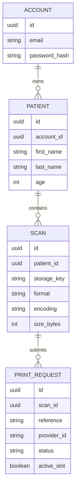
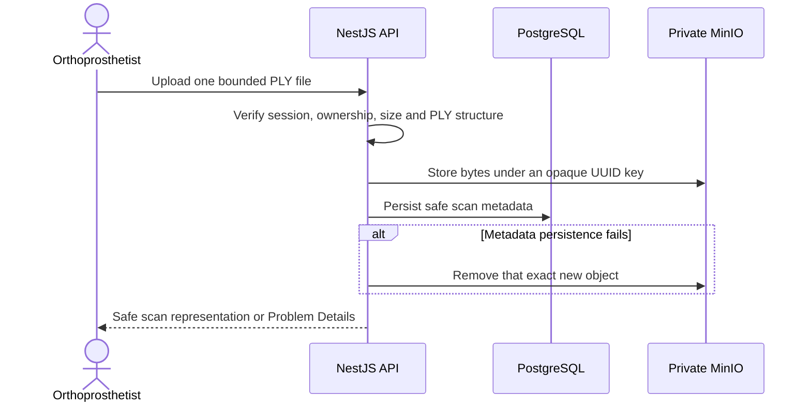
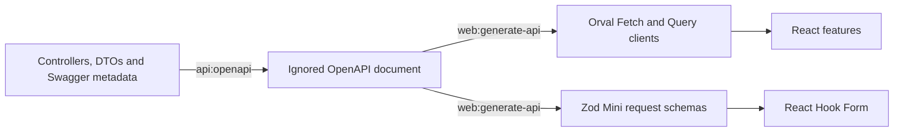

# Backend and Data

[Back to the main README](../README.md)

The NestJS API is the trust boundary for accounts, patients, scans, printing, and health. PostgreSQL owns relational
state, Liquibase owns schema history, and MinIO owns private scan bytes.

## Feature structure

```text
apps/api/src/
  accounts/       account identity and password persistence
  auth/           registration, sessions, cookie and JWT boundaries
  patients/       owner-scoped patient records and pagination
  scans/          PLY validation, private storage and download
  printing/       reservation, provider calls and reconciliation
  health/         liveness and revision-aware readiness
  shared/         proven HTTP, validation and persistence foundations
```

Each feature keeps HTTP DTOs and controllers at the edge, use-case coordination in its application boundary, and
TypeORM, MinIO, cryptographic, or provider mechanics behind concrete infrastructure adapters. Shared code exists only
for responsibilities genuinely used across features.

## Data model



| Owner             | Stored responsibility                                                                          | Never exposed publicly                                  |
| ----------------- | ---------------------------------------------------------------------------------------------- | ------------------------------------------------------- |
| PostgreSQL        | Accounts, ownership, patient data, scan metadata, print references, and last safe print state. | Password hashes and persistence details.                |
| MinIO             | PLY bytes under application-generated UUID keys.                                               | Bucket details, object keys, and original filenames.    |
| Printing provider | External production-job state.                                                                 | Credential, raw payloads, and provider-specific errors. |

## Schema ownership

`database/db.changelog-master.xml` is the schema authority. Liquibase records durable history in
`DATABASECHANGELOG`; TypeORM uses `synchronize: false` and `migrationsRun: false`.

Production changelogs are append-only. Schema changes must remain backward compatible with the immediately previous
API image because application rollback intentionally does not reverse Liquibase.

## Scan storage



Filename and MIME claims are not trusted. Downloads repeat patient and scan ownership checks, validate the stored
size, and stream bytes through the API under a synthetic filename. The narrow compensation protects new uploads
without adding a queue or speculative cleanup service.

## Executable HTTP contract



NestJS remains the runtime contract authority. Generated files are derivative, reproducible, ignored, and never
edited manually. See [Local development](local-development.md#contracts-and-generated-clients) for commands and
[Testing and quality](testing-and-quality.md) for synchronization evidence.
