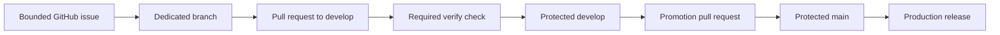
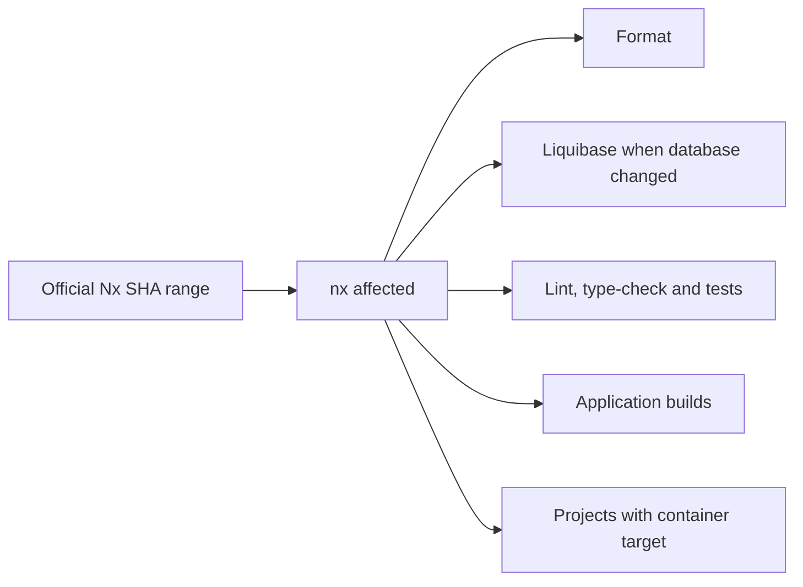
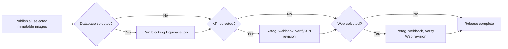

# Delivery

[Back to the main README](../README.md)

Delivery uses protected Git branches, official Nx affected selection, immutable GHCR images, Dokploy webhooks, and
revision-aware health checks. There is no hand-maintained changed-project list or custom deployment script.

## Git flow

`develop` is the integration branch and cannot deploy. Only a `develop` to `main` pull request may promote production.
Both branches require a pull request, resolved conversations, and the `verify` check; force-push and deletion are
disabled. The solo-maintainer repository requires no approval count.

## Verification and selection

The `verify` job installs with `npm ci`, creates a synthetic `.env.local`, starts temporary PostgreSQL and MinIO,
validates selected migrations, regenerates the API contract and Web client, runs affected source checks and builds,
then always stops Compose dependencies.

Nx produces the deployable-project JSON consumed by the release job. An empty result skips production before the
protected environment. A failed run remains part of the next affected range.

## Image and release identity

| Project    | Immutable image                             | Production pointer                               |
| ---------- | ------------------------------------------- | ------------------------------------------------ |
| `database` | `ghcr.io/hugoecken/vytruve-migration:<sha>` | `ghcr.io/hugoecken/vytruve-migration:production` |
| `api`      | `ghcr.io/hugoecken/vytruve-api:<sha>`       | `ghcr.io/hugoecken/vytruve-api:production`       |
| `web`      | `ghcr.io/hugoecken/vytruve-web:<sha>`       | `ghcr.io/hugoecken/vytruve-web:production`       |

The three packages are public for anonymous Dokploy pulls. Secrets are not image build arguments. API and Web images
embed the source revision; the Web image also embeds only its public API origin.

## Ordered production release

A migration failure leaves both application pointers unchanged. An API failure prevents Web promotion. A Web failure
leaves the already healthy API running. Webhook acceptance is only a trigger; the matching revision health response is
the deployment proof.

## Configuration ownership

- GitHub `production` secrets: Dokploy API credential plus API and Web webhook URLs.
- GitHub non-secret variables: Dokploy URL, migration schedule identity, production origin, and container platform.
- Dokploy: every API runtime secret and retained resource configuration.
- Image: source revision and browser-safe Web API origin only.

The production environment permits only `main`, disables administrator bypass, and has no reviewer gate for the solo
maintainer. Exact names, resource configuration, release failure behavior, and rollback commands belong to the
[Dokploy runbook](../infrastructure/dokploy/README.md).
