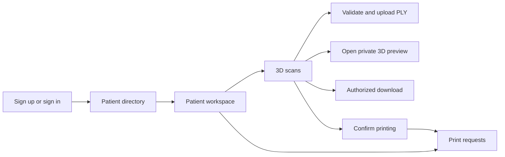
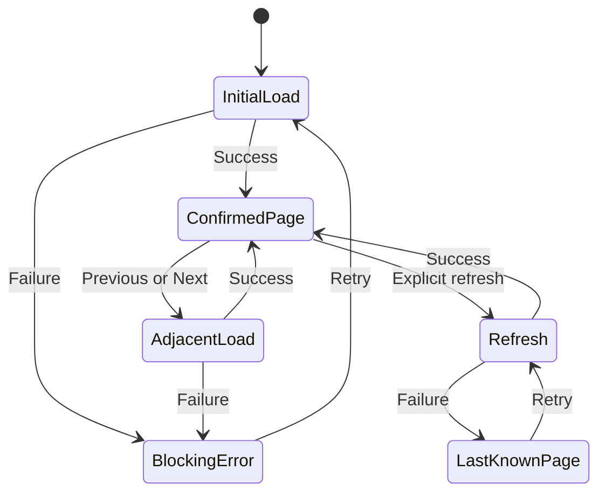

# Frontend

[Back to the main README](../README.md)

The frontend is a client-rendered React application built by Vite. TanStack Router owns typed navigation, TanStack
Query owns remote state, React Hook Form owns form interaction, and Orval-generated clients own API transport.

[Open the canonical Product Design in Figma](https://www.figma.com/design/tnvp3CFNnb4aC6VWTkK2BI/Vytruve-Product-Design?node-id=309-3)

## Composition

```text
apps/web/src/
  routes/              typed paths and route-level composition
  modules/             authentication, patients, scans and printing
  shared/api/          generated transport and safe error mapping
  shared/layout/       application shell and system fallbacks
  shared/query/        the single QueryClient
  shared/i18n/         English and French catalogs
  shared/ui/           local shadcn/ui primitives
```

Routes own paths and redirects, not feature behavior. Generated hooks own server state; components do not duplicate
query results into local snapshots. The session is restored before protected routes mount, and sign-out or expiry
clears account-scoped cache before navigation.

## User-facing flow



## Collections and recovery



Initial and adjacent-page failures show an explicit retry state because no confirmed data exists for that query. A
background refresh failure preserves already confirmed rows and marks them as last known. Provider refresh remains
separate from persisted print-list loading, so external latency does not blank the page.

## Forms and files

JSON forms use generated Zod Mini request schemas with focused interaction-only refinements such as password
confirmation. Stable server field violations return focus and localized feedback to the owning control.

Scan upload accepts one local selection and provides early feedback, but the API remains authoritative for size and
content. Patient create and edit reuse one photo field that checks JPEG, PNG, or WebP content locally, previews the
exact selection, and sends nothing before the form is confirmed. React 19 callback-ref cleanup revokes temporary Blob
URLs without retaining photo content in query state. Download actions use safe metadata already present in the row
and never reveal storage details.

The directory and workspace reuse one shadcn Avatar composition. It reads the current photo only through the
authenticated API route and falls back to locale-aware Unicode grapheme initials while keeping the full name visible.

## Private 3D preview

[The accepted preview frames in Figma](https://www.figma.com/design/tnvp3CFNnb4aC6VWTkK2BI/Vytruve-Product-Design?node-id=389-5297)
extend scan details without changing their authenticated API boundary. Opening details keeps metadata available and
starts one request to the existing private content endpoint while lazy-loading the Three.js viewer.

The viewer parses the response in memory without a public or storage URL. Closing the overlay aborts retrieval,
disposes graphics resources, and evicts the private response; reopening starts one new preparation attempt.
Implementation decisions and evidence remain in [`specs/002-interactive-scan-preview/`](../specs/002-interactive-scan-preview/).

## Visual and accessibility contract

- English and French catalogs own user-facing copy and stable error mappings.
- Dates, numbers, byte sizes, and progress are locale-aware.
- Semantic headings, labels, tables, dialogs or drawers, visible focus, and live feedback support keyboard use.
- Status never relies on color alone.
- Compact layouts preserve essential tables, actions, and Previous/Next navigation.
- Figma `Ready for Development` frames own visual composition; shadcn/ui supplies implementation primitives only.

Focused component evidence is described in [Testing and quality](testing-and-quality.md). Regenerate API clients and
the route tree through the commands in [Local development](local-development.md#contracts-and-generated-clients).
