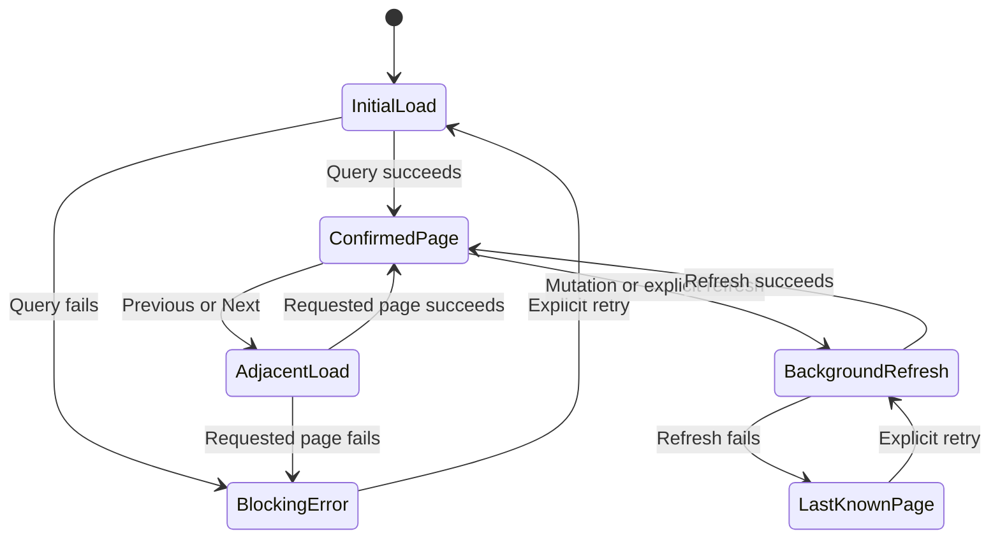

# Frontend

[Back to the main README](../README.md)

The frontend is a client-rendered React application built by Vite. It uses TanStack Router for typed file routes,
TanStack Query for all remote server state, React Hook Form for editable forms, and Orval-generated Fetch hooks and
request schemas from the NestJS OpenAPI contract.

## Composition

```text
apps/web/src/
  routes/                  typed route declarations and route-level composition
  modules/<feature>/       authentication, patients, scans, printing, and collection behavior
  shared/api/              generated-client transport and safe error mapping
  shared/layout/           application shell and system fallbacks
  shared/query/            the single QueryClient
  shared/i18n/             English and French catalogs and initialization
  shared/ui/               local shadcn/ui source primitives
  router.tsx               router construction and typed context
  main.tsx                 browser bootstrap
```

Route files own paths, parameters, redirects, and composition only. Product behavior remains in feature modules. The
authenticated layout protects `/patients` and `/patients/$patientId`; `/sign-in` and `/sign-up` redirect an already
authenticated user safely. Unknown routes show a localized non-disclosing fallback with one safe destination.

## Session and server state

The application restores the cookie-backed session before mounting route guards. A single `QueryClient` is available
through the router context. Generated hooks own server state; components do not copy query results into parallel local
snapshots.

Successful authentication writes the returned public session to its generated query key. Logout and expiry clear the
entire account-scoped cache before navigation. Requests include browser credentials centrally, and no authentication
token is accessible to React.

Queries remain fresh until an explicit invalidation, page change, retry, or manual refresh. Window focus, route
remounts, and development checks do not trigger hidden refreshes. Mutations never retry automatically.

## Collections and recovery

Patients, scans, and print requests use zero-based server pagination with Previous and Next controls and no fabricated
total. TanStack Table owns table mechanics; each feature owns columns, actions, and responsive presentation.



An initial or adjacent-page failure has no confirmed data for that query, so it shows a blocking localized retry state
without provisional rows. A background failure may retain the page already owned by TanStack Query, marks it as last
known, and offers an explicit retry.

Print-request persistence and provider-status refresh are independent. The persisted page appears first; only active
status cells show skeletons during the single automatic refresh when a page opens. Manual refresh remains available,
and the client does not poll.

## Forms and file interaction

JSON mutation forms use React Hook Form with Zod Mini schemas generated from OpenAPI plus only interaction-specific
local refinements, such as password confirmation. The API remains the trust boundary. Stable server field violations
return focus and localized feedback to the owning control, and pending submissions disable repeated activation.

Scan upload keeps one selected file inside a bounded dialog or compact drawer. The UI validates basic local eligibility
for immediate feedback, while the API performs authoritative byte and content validation. Upload and download stay in
the patient workspace. Rows open already-loaded safe metadata without an extra request; action controls do not trigger
row consultation.

## Localization, accessibility, and responsive behavior

English and French catalogs contain user-visible copy and stable error-code mappings. The browser language is used on
first visit when supported, English is the fallback, and an explicit authenticated selection persists locally. The
document language follows the resolved locale. Dates, numbers, byte sizes, and progress use locale-aware formatting.

The UI uses semantic headings, tables, form labels, dialogs or drawers, keyboard-operable rows, visible focus, live
feedback, and text or icon support for status instead of color alone. Compact layouts retain the three required tables,
essential actions, and Previous/Next navigation with touch-sized controls. The canonical Figma Product Design remains
the visual authority; shadcn/ui provides the local primitive source rather than a second product design.

## Frontend verification

Vitest, Testing Library, user-event, and MSW cover observable feature behavior at accessible boundaries. Current suites
exercise authentication validation and restoration, safe redirects and logout, patient collection recovery and
creation, patient workspace authorization, scan upload/download and storage failure, print submission and ambiguous
reconciliation, collection refresh degradation, localization-facing states, and application-shell fallbacks.

Run the frontend evidence with:

```bash
npm exec nx -- test web
npm exec nx -- run-many -t lint,typecheck,build --projects=web --nxBail
```

Generated clients and the generated TanStack route tree are ignored outputs. Regenerate them through Nx rather than
editing them:

```bash
npm exec nx -- run web:generate-api
```
