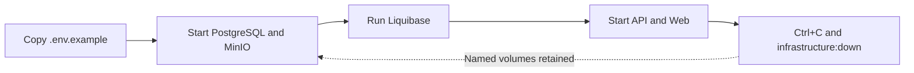

# Local Development

[Back to the main README](../README.md)

Local development keeps application processes on the host and retained dependencies in Docker. Nx is the single task
interface; npm installs dependencies and exposes only the memorable `npm start` alias.

## Clean start

Requirements: Node.js 24 LTS, npm 10, and Docker with Docker Compose.

```bash
npm ci
cp .env.example .env.local
npm exec nx -- run infrastructure:up
npm exec nx -- run database:migrate
npm start
```

| Service       | Address                     |
| ------------- | --------------------------- |
| Web           | `http://localhost:4200`     |
| API           | `http://localhost:3000/api` |
| PostgreSQL    | `127.0.0.1:5432`            |
| MinIO S3      | `http://127.0.0.1:9000`     |
| MinIO console | `http://127.0.0.1:9001`     |

Stop Web and API with `Ctrl+C`, then stop containers without deleting named volumes:

```bash
npm exec nx -- run infrastructure:down
```

PostgreSQL and MinIO state survives normal stop/start cycles. There is no reset alias because deleting reviewer data
must remain an explicit Docker decision.

## Local lifecycle



## Configuration

`.env.example` is the complete local inventory. Its committed values are synthetic and development-only. Replace the
printing-provider placeholders only in ignored `.env.local`; never commit the supplied provider credential.

The API validates its required settings before listening. The Web build receives only `VITE_API_BASE_URL`, which is
safe for browser users. Never expose a server secret through a `VITE_` variable.

| Concern                       | Variables                                                                                                                      |
| ----------------------------- | ------------------------------------------------------------------------------------------------------------------------------ |
| API runtime                   | `NODE_ENV`, `APP_REVISION`, `API_PORT`, `WEB_ORIGIN`                                                                           |
| Browser-safe Web build        | `VITE_API_BASE_URL`                                                                                                            |
| JWT                           | `JWT_SECRET`, `JWT_ISSUER`, `JWT_AUDIENCE`                                                                                     |
| PostgreSQL                    | `DATABASE_HOST`, `DATABASE_PORT`, `POSTGRES_DB`, `POSTGRES_USER`, `POSTGRES_PASSWORD`                                          |
| Scan storage                  | `MAX_SCAN_SIZE_BYTES`, `MINIO_ENDPOINT`, `MINIO_PORT`, `MINIO_USE_SSL`, `MINIO_ACCESS_KEY`, `MINIO_SECRET_KEY`, `MINIO_BUCKET` |
| Printing provider             | `PRINTING_API_BASE_URL`, `PRINTING_API_KEY`, `PRINTING_API_TIMEOUT_MS`                                                         |
| Optional local design tooling | `SHADCNDESIGN_LICENSE_KEY`                                                                                                     |

Production values do not come from this file. They belong to Dokploy and the protected GitHub environment described
in [Delivery](delivery.md) and the [Dokploy runbook](../infrastructure/dokploy/README.md).

No patient record or scan is seeded or committed. Create synthetic reviewer data through the UI.

## Infrastructure and database

```bash
npm exec nx -- run infrastructure:up
npm exec nx -- run infrastructure:status
npm exec nx -- run infrastructure:down

npm exec nx -- run database:validate
npm exec nx -- run database:status
npm exec nx -- run database:migrate
npm exec nx -- run database:rollback
```

Liquibase runs in a disposable container and waits for PostgreSQL health. `database:rollback` reverts only the latest
local changeset; it is not a production rollback mechanism.

## Contracts and generated clients

```bash
npm exec nx -- run api:openapi
npm exec nx -- run web:generate-api
```

`web:generate-api` depends on `api:openapi`. The OpenAPI document, Orval clients, request schemas, and TanStack route
tree are generated and ignored. Change their source authority and regenerate; never edit them manually.

## Production images

Application verification commands belong to [Testing and quality](testing-and-quality.md).

Build all production image definitions with synthetic revision inputs:

```bash
npm exec nx -- run web:generate-api
npm exec nx -- run-many -t container --projects=database,api,web --parallel=1 --nxBail
```

Smoke-check the self-contained Web image:

```bash
docker run --rm --detach --name vytruve-web-smoke --publish 127.0.0.1:8080:8080 vytruve-web:local
curl --fail http://127.0.0.1:8080/health/0000000000000000000000000000000000000000
docker stop vytruve-web-smoke
```

The API image requires PostgreSQL and MinIO. Its full image smoke check belongs to the existing ordered production
release instead of a second local orchestration path.

Inspect resolved Nx configuration with:

```bash
npm exec nx -- show projects --json
npm exec nx -- show project database --json
npm exec nx -- show project infrastructure --json
npm exec nx -- show project api --json
npm exec nx -- show project web --json
```
