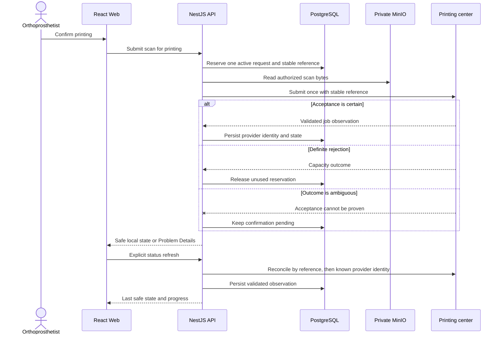

# Printing Integration

[Back to the main README](../README.md)

The printing provider exposes a non-idempotent submission boundary. The implementation prioritizes preventing a
duplicate physical production request over pretending that every network failure has a certain outcome.

## Submission and reconciliation

## Safety rules

| Risk                              | Chosen rule                                                                                  |
| --------------------------------- | -------------------------------------------------------------------------------------------- |
| Double submission                 | Reserve one active request before the provider call and never retry the write automatically. |
| Timeout after possible acceptance | Preserve `confirmation_pending`; do not claim success or failure.                            |
| Definite capacity rejection       | Remove the unused reservation so the scan can be submitted later.                            |
| Slow or unavailable provider      | Load the persisted page first; refresh external statuses separately.                         |
| Invalid provider response         | Reject it at the adapter boundary and expose only a stable application error.                |
| Credential or payload leakage     | Keep the API key in the adapter and never log scan bytes or raw provider bodies.             |

The adapter applies a finite timeout. It owns the provider URL, API key, request shape, response validation, and error
translation. Provider vocabulary does not become a public Web or API contract.

## Public lifecycle

The application exposes provider-neutral states: confirmation pending, queued, in progress, completed, or failed.

- Progress is absent while provider acceptance is unknown.
- Queued work starts at `0%`.
- Active work is time-derived and capped at `99%`.
- Only provider success produces `100%`.

The client performs one automatic refresh when a print page opens and offers an explicit manual refresh. It does not
poll continuously or retry a submission mutation.

## Why this is deliberately simple

A queue, background worker, webhook receiver, and distributed transaction would add operational surface without being
required by the assessment. The durable reference plus explicit reconciliation solves the demonstrated ambiguity while
remaining readable, testable, and deployable as one API.

See [Testing and quality](testing-and-quality.md) for provider-contract evidence and
[Decisions and limitations](decisions-and-limitations.md) for the resulting trade-offs.
