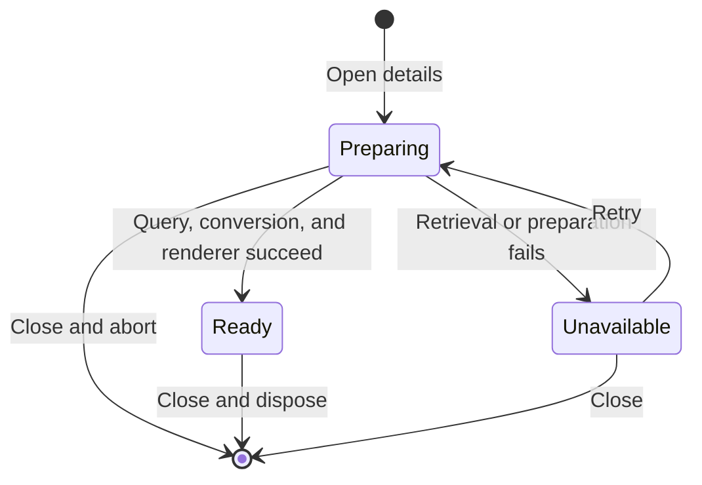

# Data Model: Interactive Scan Preview

**Status**: Accepted with the automatic-loading plan reconciliation approved on 2026-08-16

The feature adds no persisted entity, API model, database column, object-storage key, cookie, or browser-storage entry. The existing `ScanResponse` remains the only metadata model. The structures below exist only for one mounted details overlay.

## Preview Session

| Field | Type | Source | Lifetime |
| --- | --- | --- | --- |
| `patientId` | string | Existing route context | Open overlay |
| `scanId` | string | Existing selected `ScanResponse` | Open overlay |
| `attempt` | positive integer | Overlay opening or Retry action | Open overlay |
| `content` | Blob, query-owned | Authenticated content response | Active query observer |
| `renderer` | `ScanPreviewRenderer` | Successful local preparation | Mounted viewer node |

`content` is never serialized, logged, named from source metadata, or converted to a URL. The transient ArrayBuffer used during renderer creation is owned by the callback-ref setup and becomes unreachable after setup or cleanup.

## Derived State Machine



| State | Derivation | Allowed preview action |
| --- | --- | --- |
| `Preparing` | Lazy module, query, conversion, or renderer initialization pending | None |
| `Ready` | Renderer handle exists for the current attempt | Five view controls |
| `Unavailable` | Current attempt has a query or preparation failure | Retry |

The UI derives states from intent, query status, and renderer callbacks. It does not duplicate response data or persist a second domain status.

## Renderer Handle

```ts
interface ScanPreviewRenderer {
  rotateLeft(): void;
  rotateRight(): void;
  zoomIn(): void;
  zoomOut(): void;
  reset(): void;
  dispose(): void;
}
```

The handle contains no serializable state. Its initial camera position and control target are private implementation details restored by `reset()` and discarded by `dispose()`.

## Invariants

- One open scan-details overlay owns at most one active preview attempt and one renderer.
- `patientId` and `scanId` always come from the already authorized route and selected metadata contexts.
- Opening scan details starts attempt 1 and exactly one network request.
- Retry increments `attempt` and starts exactly one new network request only when no request is active.
- A renderer is ready only for a non-empty geometry with finite bounds.
- Closing the overlay unmounts the entire Preview Session; reopening creates a new Preparing session.
- Download owns its existing short-lived Blob URL separately. Preview never owns one.
