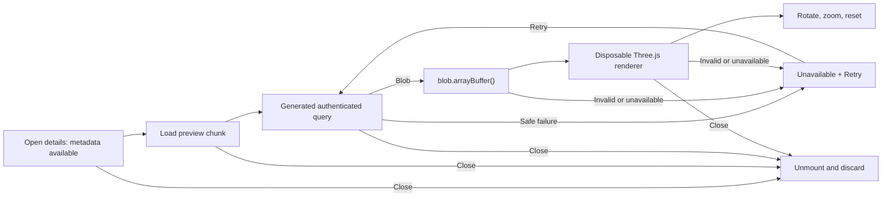

# Implementation Plan: Interactive Scan Preview

**Status**: Accepted

**Branch**: `docs/interactive-scan-preview-plan` | **Date**: 2026-08-16 | **Accepted specification**: [`spec.md`](spec.md) integrated at `c2eadd907156e1d986a9d5bed6c29030ea781167`

**Visual authority**: Figma Product Design section `05 · Interactive scan preview` (`389:5297`) in `Ready for Development`, with accepted frames `389:5324`, `389:5334`, `389:5711`, and `389:5721`.

**Planning authority**: GitHub issue #57 owns the accepted architecture at commit `048c933c94548625fea3a269e38e65e84a6f47f4`. The reviewer explicitly approved the automatic-loading amendment and its exact Figma composition on 2026-08-16. This reconciliation changes orchestration and evidence only; it introduces no new architecture decision.

## Summary

Extend the existing scan-details overlay with a private PLY preview that starts automatically when the overlay opens. Safe metadata remains immediate while one lazy frontend chunk mounts, starts the existing authenticated Orval query exactly once, converts its bounded `Blob` response to an `ArrayBuffer` without a URL, and creates a disposable Three.js viewer. The viewer supports pointer, touch, keyboard-reachable icon controls, vertex colors, a neutral fallback material, and a fitted reset view.

The implementation changes only the Web application and generated-client configuration. It adds no API operation, database state, storage URL, worker, server conversion, or deployment mechanism.

## Technical Context

**Language/Version**: TypeScript 6 on Node.js 24; React 19

**Primary Dependencies**: Existing Vite, TanStack Query, Orval, Base UI, shadcn/ui, i18next, and Lucide React; add `three@^0.185.1` and `@types/three@^0.185.1`

**Storage**: No new storage; private scan bytes remain temporary browser memory only

**Testing**: Vitest, Testing Library, user-event, MSW, synthetic in-memory PLY fixtures, Nx targets

**Target Platform**: Evergreen desktop and mobile browsers with WebGL2

**Project Type**: Existing React/Vite application in the four-project Nx workspace

**Performance Goals**: One initial request per opened scan-details overlay; one request per explicit Retry; event-driven rendering; supplied local samples interactive within three seconds after retrieval

**Constraints**: Accepted 25 MiB limit and three PLY encodings; authenticated same-origin API only; no public or Blob URL for preview; no direct `useEffect`; no continuous animation loop; no committed scan sample

**Scale/Scope**: One existing overlay, three preview states, five icon controls, two responsive compositions, two locales

## Constitution Check

### Pre-research gate

| Gate | Result | Evidence |
| --- | --- | --- |
| Accepted intent | Pass | `spec.md` is accepted at the immutable commit above. |
| Accepted design | Pass | The exact four Figma frames are in `Ready for Development`. |
| Execution authority | Pass | Issue #53 owns implementation; #57 owns planning only. |
| Source-first reuse | Pass | The existing content endpoint, generated Orval hook, overlay, query client, and UI primitives remain authoritative. |
| Protected data | Pass | Planning uses synthetic geometry and records no supplied scan name, bytes, patient data, or credential. |
| Proportionality | Pass | One lazy feature slice and one renderer facade own the new responsibility; no backend or infrastructure layer is added. |
| Generated artifacts | Pass | Orval configuration changes at source; ignored generated output is reproduced through Nx and never edited manually. |
| Derived tasks | Pass | `tasks.md` remains local to this feature and will not create GitHub issues. |

### Post-design gate

Research preserves every accepted product state and the exact Figma composition. Enabling Orval query signals is the smallest official mechanism that lets TanStack Query abort an in-flight private-content request when the overlay unmounts. The preview renderer owns only parsing, display, interaction, resize, and disposal. No constitution violation or complexity exception remains.

## Architecture

### Intent-to-disposal flow



### Query and preview state

- `ScanDetailsOverlay` continues to receive metadata from the existing collection response.
- A small `ScanPreview` boundary mounts the lazy experience as soon as scan details open. Its regular-bundle module contains no Three.js import.
- React then loads the deferred preview experience. The generated `useDownloadPatientScan` hook runs with `enabled: true`, `retry: false`, `gcTime: 0`, `refetchOnMount: false`, `refetchOnWindowFocus: false`, `refetchOnReconnect: false`, and one selected scan key.
- `orval.config.ts` changes `query.signal` from `false` to `true`. Regeneration makes generated query functions consume TanStack Query's `AbortSignal`; no generated file is edited or committed.
- Retry is available only after failure and is disabled while `isFetching`. It calls `refetch({ cancelRefetch: false })`, so repeated activation cannot restart or parallelize an active attempt.
- The opening attempt starts when the experience mounts; each Retry increments a local key. A successful refetch remounts a clean viewer even if the bytes are identical. Query error, Blob conversion failure, invalid PLY, WebGL2 failure, or allocation failure all map to the same localized unavailable state.
- Closing removes the lazy subtree. React cleanup disposes the renderer, TanStack aborts a consumed in-flight request, and `gcTime: 0` makes inactive private content immediately eligible for collection. Reopening starts one new preparing attempt.

### Lazy boundary

`scan-preview.tsx` remains in the regular scans bundle and mounts `scan-preview-experience.tsx` through `React.lazy` and `Suspense` when scan details open. The lazy module imports `scan-preview-renderer.ts`; therefore Three.js, `PLYLoader`, and `OrbitControls` stay outside the initial application chunk even though preparation starts without a second action. Vite output inspection must confirm a distinct deferred chunk.

### Renderer boundary

The feature-internal factory receives one container element, one `ArrayBuffer`, and ready/unavailable callbacks. It returns only:

```ts
interface ScanPreviewRenderer {
  rotateLeft(): void;
  rotateRight(): void;
  zoomIn(): void;
  zoomOut(): void;
  reset(): void;
  dispose(): void;
}
```

The factory:

1. verifies WebGL2 before constructing `WebGLRenderer`;
2. parses the raw buffer with `PLYLoader.parse` and rejects missing positions, zero vertices, non-finite bounds, or an empty bounding sphere;
3. computes vertex normals only when absent;
4. centers the geometry and fits a perspective camera to its bounding sphere;
5. uses vertex colors when present and one neutral non-diagnostic material otherwise, under fixed ambient and directional lights;
6. configures `OrbitControls` with pan, auto-rotate, and damping disabled;
7. caps device pixel ratio at 2 and observes the container with `ResizeObserver`;
8. renders once after setup and again only for a control change, pointer/touch interaction, or resize;
9. disconnects the observer and controls, then disposes geometry, material, and WebGL renderer exactly once.

The canvas callback ref returns the React 19 cleanup function. It converts the Blob asynchronously, ignores completion after cleanup, creates the renderer, and disposes any late-created resource. No direct `useEffect`, Blob URL, animation loop, or global listener is required.

### Responsive and accessible UI

- Add only `contentClassName?: string` to `ResponsiveDetailsOverlay`; it widens the desktop dialog without introducing a preview-specific boolean.
- Desktop uses the accepted wide dialog with a 4:3 viewer beside metadata. Compact uses the existing scrollable drawer with viewer, controls, then metadata.
- The interactive viewer root carries `data-base-ui-swipe-ignore`, preserving canvas gestures without disabling drawer dismissal elsewhere.
- Five shadcn icon buttons remain on one row and expose localized accessible names and visible focus: rotate left, rotate right, zoom in, zoom out, and reset. They have no visible text labels at either viewport.
- Preparing uses a polite status without privacy or storage-URL explanatory copy. Unavailable uses one generic localized message and a compact outline Retry action. Technical errors, object keys, filenames, bytes, and storage details are never rendered or logged.
- Existing Download, Print, metadata, selection, and close behaviors remain independently wired.

## Project Structure

### Documentation

```text
specs/002-interactive-scan-preview/
├── spec.md
├── plan.md
├── research.md
├── data-model.md
├── quickstart.md
├── contracts/
│   └── interactive-scan-preview-ui.md
└── tasks.md
```

### Source code

```text
orval.config.ts
package.json
package-lock.json
docs/frontend.md
apps/web/src/
├── modules/scans/
│   ├── lib/
│   │   ├── scan-preview-renderer.ts
│   │   └── scan-preview-renderer.test.ts
│   └── ui/
│       ├── scan-preview.tsx
│       ├── scan-preview-experience.tsx
│       ├── scan-preview-experience.test.tsx
│       ├── scans-panel.tsx
│       └── scans-panel.test.tsx
└── shared/
    ├── i18n/locales/en.json
    ├── i18n/locales/fr.json
    └── ui/responsive-details-overlay.tsx
```

**Structure decision**: Keep the orchestration beside the current scan UI and the graphics lifecycle in one scan-specific library file. Do not create a generic viewer package, shared 3D abstraction, new Nx project, or backend boundary.

## Complexity Tracking

No constitution violation requires an exception.
