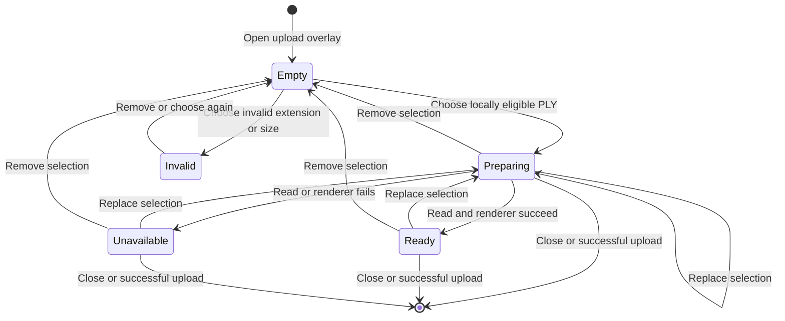

# Data Model: Scan Upload Preview

**Status**: Accepted with plan fingerprint `aaf4389c8b48aa46cde771f5198785d3453643d1610892ffdfd5f29d64a77c2c`

The feature adds no persisted entity, API model, database column, object-storage key, cookie, query cache entry, or browser-storage value. The structures below exist only while one scan upload overlay is mounted.

## Selected Upload File

| Field | Type | Source | Lifetime |
| --- | --- | --- | --- |
| `file` | `File` | Existing file input | Current overlay selection |
| `localFailure` | `size \| type \| null` | Existing derived validation | Current selection |
| `previewData` | `Promise<ArrayBuffer> \| null` | One eligible selection event | Current selection |
| `uploadState` | Existing generated mutation state | Explicit Add scan action | Current overlay |

The file and its one optional read promise form the ephemeral selection. Invalid files have `previewData: null`. The upload mutation still receives the original `file`; the promise is consumed only by the local preview lifecycle.

## Local Preview Session

| Field | Type | Source | Lifetime |
| --- | --- | --- | --- |
| `selection` | Ephemeral selection identity | Current selected file and read promise | One preview attempt |
| `buffer` | `ArrayBuffer` | `selection.previewData` | Renderer setup or late guarded completion |
| `renderer` | `ScanPreviewRenderer` | Successful setup | Mounted preview container |
| `state` | `{ source, status }` | Read and renderer callbacks | Current selection promise |

The buffer is never serialized, logged, named, cached, converted to a URL, or submitted by the preview. The upload mutation continues to receive the original selected `File` only after explicit confirmation.

## Derived State Machine

## Invariants

- At most one preview session belongs to the current selected `File`.
- Exactly one `arrayBuffer()` call is made for each locally eligible selection, including under React Strict Mode.
- A locally invalid selection creates no preview session.
- Preparing and ready render the same viewport and five-control footprint; only readiness changes.
- Preview success or failure never changes existing upload eligibility.
- Explicit Add scan submits the original selected `File`, never its buffer or geometry.
- Replacement, removal, close, and successful upload dispose the renderer and invalidate late asynchronous completion.
- No selected bytes, original or supplied filenames, viewpoint, or renderer survive the overlay session.
