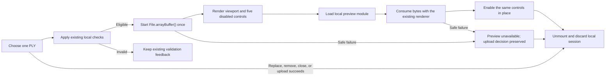

# Implementation Plan: Scan Upload Preview

**Status**: Accepted

**Branch**: `docs/scan-upload-preview-plan` | **Date**: 2026-08-16 | **Accepted specification**: [`spec.md`](spec.md) integrated at `5c39c320b3165fb971603278ac52322699e8e7bc`

**Visual authority**: Figma section `06 · Scan upload preview` (`417:6028`) in `Ready for Development`, with approved frames `417:6029`, `417:6113`, `417:6214`, and `417:6297`.

**Planning authority**: GitHub issue #63 owns this plan. The current user explicitly accepted candidate fingerprint `aaf4389c8b48aa46cde771f5198785d3453643d1610892ffdfd5f29d64a77c2c` on 2026-08-16. Runtime implementation remains blocked until this accepted plan is integrated into `develop`.

## Summary

Extend the existing scan upload overlay with a local preview of the exact selected `File`. After the existing local checks pass, the selection event starts exactly one standard `File.arrayBuffer()` promise. The regular Web bundle renders the viewer footprint and five disabled controls immediately, then one lazy module consumes that promise with the delivered disposable Three.js renderer. No request occurs before the existing explicit Add scan action.

The same eager toolbar also fixes the existing scan-details Suspense fallback so its controls never appear after the viewport. Preview failure remains local and non-blocking for an otherwise eligible upload. The implementation changes only the Web application and translation catalogues; it adds no dependency, API, generated client, database, storage, deployment, worker, URL, or persistence mechanism.

## Technical Context

**Language/Version**: TypeScript 6 on Node.js 24; React 19

**Primary Dependencies**: Existing Vite 8, Three.js 0.185.1, Base UI 1.7, shadcn/ui, i18next, Lucide React, TanStack Query, and generated Orval client

**Storage**: No new storage; the selected `File`, temporary `ArrayBuffer`, viewpoint, and renderer remain in one mounted upload overlay only

**Testing**: Vitest 4, Testing Library, user-event, MSW, synthetic in-memory PLY fixtures, and Nx targets

**Target Platform**: Evergreen desktop and mobile browsers with WebGL2; safe local fallback when WebGL2 or temporary resources are unavailable

**Project Type**: Existing React/Vite application in the Nx workspace

**Performance Goals**: Zero preview network requests; one local read and renderer attempt per eligible selection; supplied local samples interactive within three seconds after bytes become available; no idle render loop

**Constraints**: Existing 25 MiB limit and PLY rules; exact selected file only; explicit upload only; no `useEffect`, Blob URL, public URL, browser storage, log, committed sample, or new dependency

**Scale/Scope**: One upload overlay, one existing-preview fallback, three local preview states, five controls, two responsive compositions, two locales

## Constitution Check

### Pre-research gate

| Gate | Result | Evidence |
| --- | --- | --- |
| Accepted intent | Pass | `spec.md` is accepted and integrated at the immutable commit above. |
| Accepted design | Pass | The four exact Figma frames are approved and in `Ready for Development`. |
| Execution authority | Pass | Issue #63 owns the bounded correction and local upload-preview feature. |
| Source-first reuse | Pass | The delivered renderer, upload mutation, responsive overlays, shadcn primitives, semantic CSS tokens, and translations remain authoritative. |
| Protected data | Pass | Planning and tests use synthetic names and PLY bytes; supplied files remain local manual evidence only. |
| Proportionality | Pass | One eager toolbar and one local lazy orchestration component reuse the existing renderer; no generic 3D package or backend layer is added. |
| Generated artifacts | Pass | No OpenAPI or Orval source changes are required. Generated output remains untouched. |
| Derived tasks | Pass | `tasks.md` will remain local to this feature and will not create GitHub issues. |

### Post-design gate

Research preserves the accepted upload decision and server validation boundary. `File` already inherits the standard `Blob.arrayBuffer()` primitive, and the existing renderer already consumes the resulting `ArrayBuffer`. Starting that promise in the selection event prevents React Strict Mode from duplicating the read. The toolbar moves to an eager feature-owned module with a type-only renderer dependency, keeping Three.js deferred. Callback-ref cleanup owns the renderer lifecycle and ignores late promise completion without `useEffect`. A bounded PLY header check blocks add-on diagnostics before the official loader parses geometry. The official Three.js console hook remains scoped to the synchronous parse call because the loader computes bounds before caller-side geometry validation; it is restored in `finally`. No constitution violation or complexity exception remains.

## Architecture

### Selection-to-disposal flow



### Stable eager shell

- Extract the delivered five-button toolbar from `scan-preview-experience.tsx` into one feature-owned regular-bundle module.
- Both `scan-preview.tsx` and the new upload-preview boundary render the same viewport footprint plus toolbar in their Suspense fallback.
- The toolbar accepts only readiness and a nullable renderer command reference. It imports the renderer interface with `import type`, so it cannot pull Three.js into the eager bundle.
- Preparing controls are real disabled buttons with the same DOM order, size, spacing, accessible names, and semantic-token styling as ready controls. Readiness changes only `disabled` and the renderer reference.
- Existing-scan retrieval and Retry behavior remain unchanged; only its earliest lazy fallback gains the stable toolbar.

### Local upload orchestration

- Extract the current extension and size checks into one small private pure function in `scan-upload-overlay.tsx` so selection and rendering cannot disagree.
- `ScanUploadOverlay` stores one ephemeral eligible selection as `{ file, previewData }`, where `previewData` is the single `file.arrayBuffer()` promise created by the input change handler. Invalid selections retain their file and existing validation feedback but create no promise.
- A small `ScanUploadPreview` boundary mounts only when a file passes the existing local checks. Invalid type or size never loads the preview chunk.
- The lazy `ScanUploadPreviewExperience` consumes `previewData`, passes its result to `createScanPreviewRenderer`, and maps read, PLY, WebGL2, or allocation failure to one localized unavailable state.
- Preparation state is tagged with the current `previewData` promise. A replacement therefore derives a fresh preparing state immediately without an effect, counter, or mutable module state.
- Replacing the file changes the callback ref dependency. Its cleanup disposes the previous renderer and an `active` guard ignores any late promise completion.
- Removal, overlay close, and successful upload unmount the preview subtree. The React 19 callback-ref cleanup disposes the renderer and makes the temporary buffer and viewpoint unreachable.
- Preview failure exposes no Retry action because the accepted upload flow already offers replace, remove, cancel, and explicit Add scan. It does not disable Add scan when the existing local rules allow submission.
- Preview creates no query, mutation, Blob URL, public URL, object-storage reference, cache entry, log, or persistent state.

### Renderer reuse

`createScanPreviewRenderer` remains the single graphics owner and keeps its current command facade:

```ts
interface ScanPreviewRenderer {
  rotateLeft(): void;
  rotateRight(): void;
  zoomIn(): void;
  zoomOut(): void;
  reset(): void;
  dispose(): void;
}
```

No material, camera, resize, gesture, or cleanup fork is introduced. The official `PLYLoader` remains the sole geometry parser. Before calling it, one bounded feature-local header check accepts only standard PLY header directives and passes the technical encoding through the existing `onReady` callback for the upload facts. Unknown directives therefore fail before the add-on's native diagnostic. During the synchronous official parse only, Three.js's documented console hook suppresses core bounding diagnostics that run before caller-side validation and is restored in `finally`; no native-console patch or persistent global override is used. The existing renderer continues to preserve vertex colors, use the neutral material fallback, fit the camera, cap pixel ratio, render only on events, apply `data-base-ui-swipe-ignore`, and dispose CPU/GPU resources.

### Responsive and localized UI

- Desktop widens only the upload dialog content through its existing class composition; compact keeps the current scrollable Drawer.
- Ready, preparing, and unavailable states match Figma `417:6029`, `417:6113`, `417:6214`, and `417:6297`.
- All new styling uses existing semantic classes backed by `globals.css`; no color, radius, spacing, shadow, or typography token changes are required.
- The five controls remain icon-only at both widths, on one row, keyboard reachable, visibly focused, and programmatically named.
- French encoding presentation becomes `Binaire (little-endian)` and `Binaire (big-endian)`. Technical PLY values and English strings do not change.
- No privacy badge, public-URL explanation, storage detail, or upload-preview Retry button is rendered.

## Project Structure

### Documentation

```text
specs/003-scan-upload-preview/
├── spec.md
├── plan.md
├── research.md
├── data-model.md
├── quickstart.md
├── contracts/
│   └── scan-upload-preview-ui.md
└── tasks.md
```

### Source code

```text
apps/web/src/modules/scans/
├── lib/
│   ├── scan-preview-renderer.ts
│   └── scan-preview-renderer.test.ts
└── ui/
    ├── scan-preview-toolbar.tsx
    ├── scan-preview.tsx
    ├── scan-preview.test.tsx
    ├── scan-preview-experience.tsx
    ├── scan-upload-preview.tsx
    ├── scan-upload-preview-experience.tsx
    ├── scan-upload-overlay.tsx
    └── scan-upload-overlay.test.tsx

apps/web/src/shared/i18n/locales/
├── en.json
└── fr.json
```

**Structure decision**: Keep eager presentation, lazy orchestration, and graphics lifecycle separate only because they preserve the deferred Three.js boundary. Test behavior through the existing overlay, preview, and renderer suites instead of adding tests for trivial presentation modules. Keep the validation helper private to the existing overlay. Do not create a shared viewer package, hook framework, worker, API adapter, new Nx project, or backend boundary.

## Complexity Tracking

No constitution violation requires an exception.
